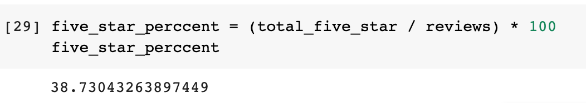

# Amazon_Vine_Analysis

## Overview
This project analyze Amazon reviews written by members of paid Amazon Vine program. By accessing the video game review dataset, we use PySpark to perform the ETL process to extract the datset, transform the data, and connect to an AWS RDS instance, and finaly load the transformed data into pgAdmin for further analysis.
At the end we will use PySpark to determine if there is any bias toward favorable reviews from Vine members in the dataset.

### Data Source:
* Video Games Review Datasets[https://s3.amazonaws.com/amazon-reviews-pds/tsv/amazon_reviews_us_Video_Games_v1_00.tsv.gz]

## Results
### Total Number of Reviews
* Total reviews\

*  Vine member reviews\

* Non-Vine member reviews\

### 5-Star Reviews
* Total 5-Star Reviews\

* Vine member reviews\

* Non-Vine member reviews\

### 5-Star Review Percentage
* Total percentage\

*  Vine member reviews\

* Non-Vine member reviews\

## Summary
The 5-star reviews percentage for Vine progream were 51% while the percentage in non-program user were only about 38%. This indicates a bias for reviews by user of the Vine program. If we look at the 5-star percentage in the entire dataset, the number was 38% which is similar to the non-Vine program percentage. This indicates that the bias for Vine program might not have significant impact on the entire dataset.
